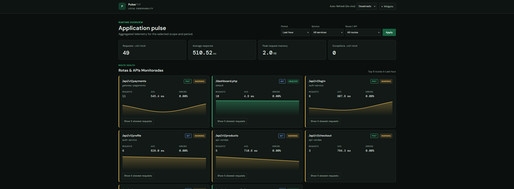
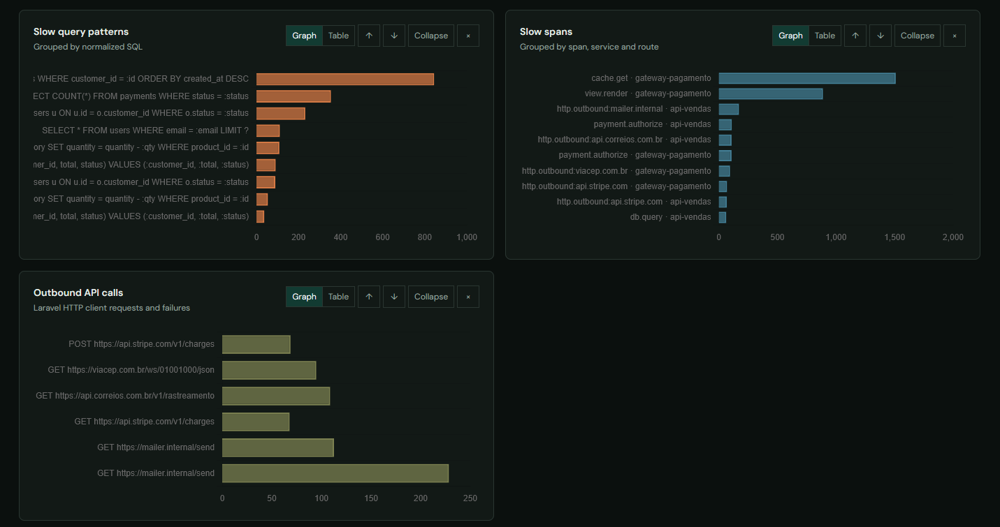
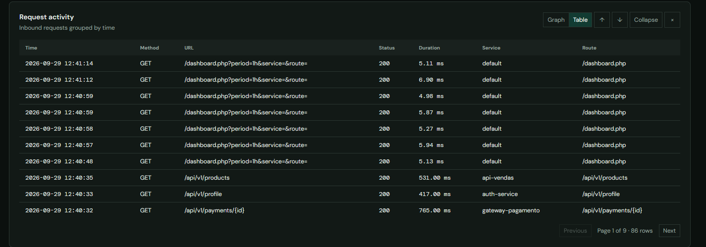
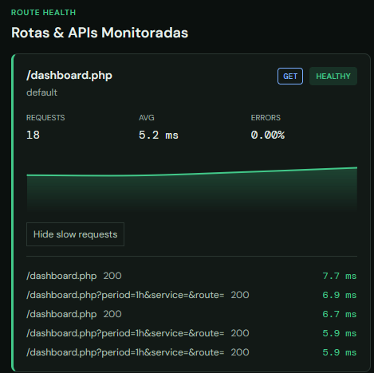
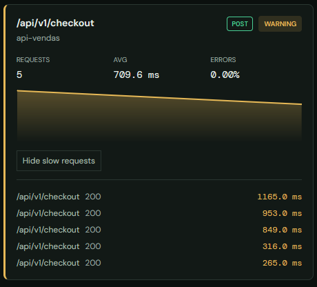
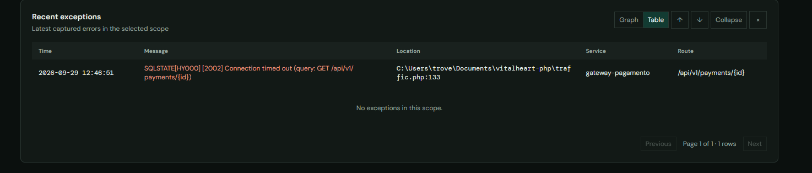
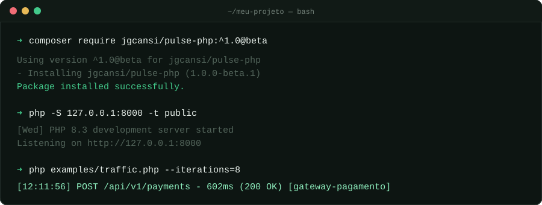
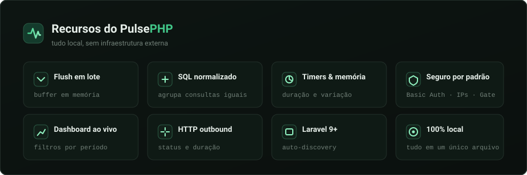

<p align="center"></p>

<h1 align="center">PulsePHP</h1>

<p align="center">
  <b>Observabilidade, monitoramento e telemetria para PHP 8.1+ e Laravel — 100% local, em SQLite.</b>
  <br/>
  <sub>Sem banco externo, sem agente, sem SaaS. Um único arquivo, um dashboard completo.</sub>
</p>

<p align="center">
  <a href="#-demonstração-em-ação"><b>Demo</b></a> ·
  <a href="#-instalação"><b>Instalação</b></a> ·
  <a href="#-uso"><b>Uso</b></a> ·
  <a href="#-laravel"><b>Laravel</b></a> ·
  <a href="#-roadmap"><b>Roadmap</b></a> ·
  <a href="#-contribuição"><b>Contribuição</b></a>
</p>

<!-- BADGES -->
<p align="center">
  <a href="https://github.com/jgcansi/pulse-php/releases"></a>
  <a href="https://github.com/jgcansi/pulse-php/actions/workflows/tests.yml"></a>
  <a href="LICENSE"></a>
</p>

<p align="center">
  
  
  
  
  
</p>

<p align="center">
  <a href="#-demonstração-em-ação"></a>
    <a href="#-instalação"></a>
  <a href="#-uso"></a>
  <a href="https://github.com/jgcansi/pulse-php/discussions"></a>
</p>

<p align="center">
  <a href="#-demonstração-em-ação">
    
  </a>
  <br/>
  <sub>Dashboard do PulsePHP rodando localmente — <a href="#-demonstração-em-ação">veja mais prints ↓</a></sub>
</p>

---

## 🎬 Demonstração em Ação

> Prints reais do dashboard rodando: navegação, filtros por período/serviço/rota, gráficos, widgets e detecção de erros em tempo real.

### 📊 Visão geral e gráficos

<p align="center">
  
  <br/>
  <sub>Gráficos ao vivo de requisições, latência e throughput por serviço e rota.</sub>
</p>

### 🧩 Widgets e atividade

<p align="center">
  
  <br/>
  <sub>Widgets: slow query patterns, slow spans e outbound API calls.</sub>
</p>

<p align="center">
  
  <br/>
  <sub>Lista de atividade — requisições recentes com método, status e duração.</sub>
</p>

### 🩺 Saúde por rota

<p align="center">
  
  &nbsp;
  
  <br/>
  <sub>Cartões de saúde por rota — estado saudável (esquerda) e estado de atenção (direita).</sub>
</p>

### 🚨 Erros e exceções

<p align="center">
  
  <br/>
  <sub>Painel de erros — exceções recentes com classe, rota e serviço.</sub>
</p>

<p align="center">
  
  <br/>
  <sub>Terminal — instalação via Composer, execução e tráfego de exemplo.</sub>
</p>

---

## 🔭 Visão Geral

**PulsePHP** é uma biblioteca de observabilidade local para **PHP 8.1+** e **Laravel 9+**. Ela captura requisições, exceções, queries SQL e chamadas externas, e mostra tudo em um **dashboard ao vivo** — usando apenas um arquivo **SQLite**, sem nenhuma infraestrutura externa (sem Redis, sem banco de métricas, sem serviço na nuvem).

- 🎯 **Local por padrão** — seus dados ficam no seu servidor, em um SQLite.
- ⚡ **Leve** — buffer em memória com gravação em lote, sem overhead por request.
- 🧩 **Integrável** — funciona standalone em PHP puro ou plugado no Laravel 9+.
- 🔐 **Seguro** — dashboard negado por padrão (Basic Auth + IPs + Gate).

<p align="center">
  
  <br/>
  <sub>Tudo em um único SQLite: requisições, latência, queries, spans e chamadas externas.</sub>
</p>

---

## ✨ Recursos Principais

<p align="center">
  
</p>

- [x] Buffer em memória com gravação em lote no encerramento do processo.
- [x] Normalização e catalogação de SQL para agrupar consultas equivalentes.
- [x] Timers para medir duração e variação de memória de operações.
- [x] Captura automática de requisições web e exceções.
- [x] Contexto de serviço e de rota em cada requisição.
- [x] Captura automática de chamadas do cliente `Http` do Laravel (método, status, destino, duração).
- [x] Dashboard ao vivo com filtros por período, serviço e rota.
- [x] Segurança por padrão: dashboard negado até configurar uma política de acesso.
- [x] Integração opcional com Laravel 9+ via auto-discovery.
- [x] Dados sempre locais — nada sai da sua máquina.

<table>
  <tr>
    <td width="50%" align="center">
      
      <br/>
      <sub><b>Widgets</b> — slow queries, spans e chamadas externas.</sub>
    </td>
    <td width="50%" align="center">
      
      <br/>
      <sub><b>Saúde por rota</b> — detecção de degradação.</sub>
    </td>
  </tr>
</table>

---

## 🏗️ Arquitetura & Tecnologias

| Camada | Tecnologia | Descrição |
| --- | --- | --- |
| **Core** | PHP 8.1+ | Núcleo standalone, sem dependência de framework. |
| **Integração** | Laravel 9+ | Service provider com auto-discovery (opcional). |
| **Dados** | SQLite (`pdo_sqlite`) | Armazenamento local em arquivo único. |
| **Dashboard** | HTML + JS | Filtros, gráficos, sparklines e auto-refresh. |
| **Testes** | PHPUnit | Suíte automatizada em PHP 8.1, 8.2 e 8.3. |

<p align="center">
  
  
  
  
  
</p>

---

## ⚙️ Instalação

### Pré-requisitos

```bash
php --version            # 8.1 ou superior
php -m | grep -i sqlite  # extensões pdo e pdo_sqlite
```

### Instale pelo Composer

> A versão atual é um **pré-lançamento** (`beta.1`). Por isso o Composer exige que você permita explicitamente versões instáveis:

```bash
composer require jgcansi/pulse-php:^1.0@beta
```

Quando a versão estável `1.0.0` for publicada, o comando volta a ser simplesmente `composer require jgcansi/pulse-php`.

**Requisitos:** PHP 8.1+ com as extensões `pdo`, `pdo_sqlite` e `json` (esta última já vem habilitada por padrão no PHP 8+).

---


## 📖 Uso

### Uso rápido (standalone)

Inicialize o Pulse **uma vez** no ponto de entrada da aplicação. Os helpers `pulse()`, `pulse_metric()`, `pulse_start()` e `pulse_end()` são carregados automaticamente pelo Composer:

```php
<?php

require __DIR__ . '/vendor/autoload.php';

use PulsePHP\Pulse;

Pulse::init(__DIR__ . '/storage/pulse.sqlite');

pulse('pedido.criado');
pulse_metric('valor_venda', 250.00, ['categoria' => 'eletronicos']);

pulse_start('relatorio.gerar');
// Gere o relatório.
pulse_end('relatorio.gerar');
```

### Subir o Dashboard local

O repositório inclui `public/dashboard.php`. Configure credenciais fortes e rode o servidor embutido **apenas em loopback**:

```bash
# Linux / macOS
export PULSE_DASHBOARD_USER=pulse-admin
export PULSE_DASHBOARD_PASSWORD='use-um-segredo-forte'
php -S 127.0.0.1:8000 -t public

# Windows (PowerShell)
$env:PULSE_DASHBOARD_USER="pulse-admin"
$env:PULSE_DASHBOARD_PASSWORD="use-um-segredo-forte"
php -S 127.0.0.1:8000 -t public
```

Acesse **http://127.0.0.1:8000/dashboard.php**

O exemplo restringe o acesso a `127.0.0.1` e `::1`; quando as variáveis Basic Auth estão configuradas, as credenciais também são exigidas. As políticas são cumulativas. Não exponha o endpoint publicamente sem autenticação, restrições de rede e HTTPS.

### Gerar tráfego de exemplo

Em outra janela do terminal, simule requisições para ver o dashboard ganhar vida (a partir da raiz do repositório):

```bash
# Contínuo (Ctrl+C para parar)
php examples/traffic.php

# Execução controlada — útil para demos e GIFs
php examples/traffic.php --iterations=10
```

> O script grava cada request imediatamente em `storage/database.sqlite`.

Com o tráfego rodando, o dashboard ganha vida em segundos — incluindo a detecção de erros:

<p align="center">
  
  <br/>
  <sub>Exceções recentes com classe, rota e serviço, capturadas automaticamente.</sub>
</p>

### Como instrumentar sua aplicação

Em PHP puro, requisições web e exceções são capturadas automaticamente pelos coletores do `Pulse::init()`. Consultas SQL, porém, são registradas explicitamente:

```php
Pulse::getInstance()->recordQuery(
    'SELECT * FROM users WHERE id = 42',
    1.25 // duração em ms
);
```

Chamadas outbound só são interceptadas quando passam pelo cliente HTTP do Laravel; Guzzle usado diretamente não é capturado.

Aplicações que instanciam o Dashboard diretamente devem configurar pelo menos uma política:

```php
use PulsePHP\Dashboard\Dashboard;

$dashboard = new Dashboard($databasePath);
$dashboard->authorize(static fn (): bool => $currentUser->isAdmin());
$dashboard->render();
```


---

## 🚀 Laravel

O service provider é **descoberto automaticamente** pelo Composer. Nenhum passo extra de registro.

### 1. Publique a configuração

```bash
php artisan vendor:publish --tag=pulse-config
```

Por padrão, o Dashboard fica em **`/pulse`** e o banco em `storage/pulse.sqlite` (ajustável via `database_path` em `config/pulse.php`).

### 2. Autorize o acesso

O acesso permanece **negado até você definir o Gate `viewPulse`**:

```php
use Illuminate\Support\Facades\Gate;

Gate::define('viewPulse', static fn (User $user): bool => $user->is_admin);
```

Opcionalmente, combine Basic Auth e whitelist de IPs no `.env`:

```dotenv
PULSE_DASHBOARD_USER=pulse-admin
PULSE_DASHBOARD_PASSWORD=use-um-segredo-forte
PULSE_DASHBOARD_IPS=127.0.0.1,::1
PULSE_SERVICE_NAME=api-pagamentos
```

Quando configuradas, as credenciais e a whitelist são verificadas além do Gate. O arquivo publicado também permite ajustar `enabled`, rota, middleware e coletores.

### 3. Pronto — a captura é automática

As chamadas feitas com `Illuminate\Support\Facades\Http` aparecem como span `http.outbound:{host}` **e** na tabela de chamadas externas, com método, status e duração. Credenciais e query string são **removidas** da URL persistida por segurança:

```php
use Illuminate\Support\Facades\Http;

$response = Http::withToken(config('services.stripe.secret'))
    ->get('https://api.stripe.com/v1/balance');
```

> Sem `pulse_start()` manual ao redor das chamadas — o middleware e os eventos do cliente HTTP cuidam de tudo. A captura cobre o cliente `Http` do Laravel; chamadas Guzzle diretas não passam por esse interceptor.

As rotas web e API recebem contexto com o nome da rota resolvida ou seu URI. O serviço usa `PULSE_SERVICE_NAME`, com fallback para `APP_NAME` e depois `default`. Bancos SQLite v1 existentes recebem as novas colunas na inicialização, sem apagar os registros anteriores.

---

## Configuração

| Variável / chave | Padrão | Descrição |
| --- | --- | --- |
| `pulse.enabled` | `true` | Liga/desliga toda a coleta. |
| `pulse.database_path` | `storage/pulse.sqlite` | Caminho do banco SQLite. |
| `pulse.service_name` | `default` | Nome do serviço exibido no dashboard. |
| `pulse.dashboard_path` | `pulse` | Rota do dashboard no Laravel. |
| `pulse.dashboard_middleware` | `['web']` | Middleware aplicado à rota do dashboard. |
| `pulse.dashboard_user` | `null` | Usuário do Basic Auth do dashboard (`.env: PULSE_DASHBOARD_USER`). |
| `pulse.dashboard_password` | `null` | Senha do Basic Auth do dashboard (`.env: PULSE_DASHBOARD_PASSWORD`). |
| `pulse.dashboard_allowed_ips` | `[]` | Whitelist de IPs do dashboard (`.env: PULSE_DASHBOARD_IPS`). |
| `pulse.collect_requests` | `true` | Captura de requisições web. |
| `pulse.collect_exceptions` | `true` | Captura de exceções. |
| `pulse.collect_queries` | `true` | Captura de consultas SQL. |
| `pulse.collect_outbound_requests` | `true` | Captura de chamadas HTTP externas (cliente `Http` do Laravel). |

---

## 🧪 Testes

```bash
composer install
vendor/bin/phpunit
```

A suíte roda no GitHub Actions em **PHP 8.1, 8.2 e 8.3**.

```text
..............                        14 / 14 (100%)

OK (14 tests, 114 assertions)
```

---

## 🗺️ Roadmap

- [x] Núcleo standalone com buffer e flush em lote
- [x] Normalização e catalogação de SQL
- [x] Dashboard ao vivo com filtros e widgets
- [x] Integração opcional com Laravel 9+
- [ ] Exportação de traces em formato OpenTelemetry
- [ ] Retenção configurável e rotação do banco
- [ ] Alertas por e-mail / webhook

Veja os [issues abertos](https://github.com/jgcansi/pulse-php/issues) para o plano completo.

---

## 🤝 Contribuição

Contribuições são muito bem-vindas! Abra uma *issue* para discutir ideias ou envie um *pull request*.

```bash
# Fork -> branch -> commit -> pull request
git clone https://github.com/jgcansi/pulse-php.git
cd pulse-php
composer install
git checkout -b feat/minha-feature
git commit -m "feat: adiciona minha feature"
git push origin feat/minha-feature
```

1. Faça um **fork** do projeto.
2. Crie uma branch (`git checkout -b feat/minha-feature`).
3. Rode a suíte (`vendor/bin/phpunit`) antes de abrir o PR.
4. Abra um **pull request** descrevendo a mudança.

---

## 📄 Licença

Distribuído sob a **Licença MIT**. Veja [`LICENSE`](LICENSE) para detalhes.

Criado e mantido por **[João Gabriel Cansi Silveira](https://github.com/jgcansi)**.

<div align="center">

<p align="center">
  <a href="https://github.com/jgcansi/pulse-php/stargazers">
    
  </a>
</p>

<br/>

**Se o PulsePHP foi útil pra você, deixe uma ⭐ — ajuda demais!**

</div>